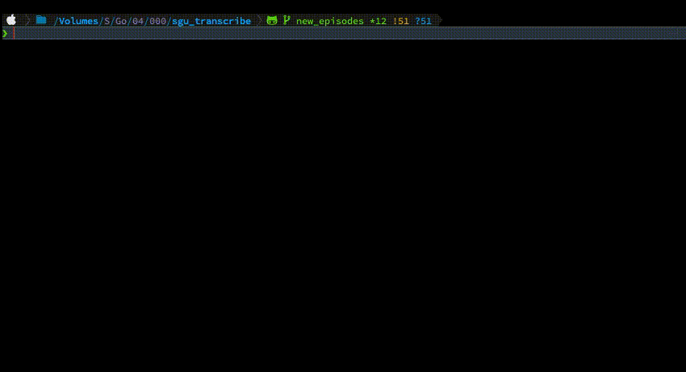

# SGU Transcripts & Search Engine (**SGU-TSE**)

A Django based search engine and transcripts generator for the Skeptics Guide to the Universe (SGU) podcast.

# Functionality

## Submit for transcription

## Get transcripts

## Search

<!-- ffmpeg -i screen_rec.mov -s 800x600 -pix_fmt rgb24 -r 10 -f gif - | gifsicle --optimize=3 --delay=1 > out.gif -->

# Like that project?

Consider becoming a patreon by clicking https://www.patreon.com/maciejgierada

# Contributions

Contributions are highly welcome! There is still a lot of work to be done!

# Wish List

- [ ] better design
- [ ] set up an event listiner to check for new episodes, get detials, submit for transcription, get transcript and populate DB in automated fashion
- [ ] use timestaps to navigate to the exact moment in the audio file matching the query
- [ ] better transcripts quality
- [ ] improved search-engine by implementing a method to search for an almost exact match
- [ ] refactoring
- [ ] documentation

# Tech Stack

- Python
- HTML/CSS
- JavaScript
- Django
- PostgreSQL
- Selenium
- Assemblyai
- Haystack
- Heroku
- CI/CD pipelines
